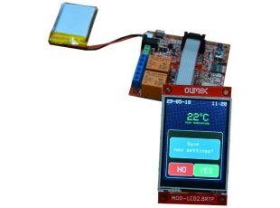
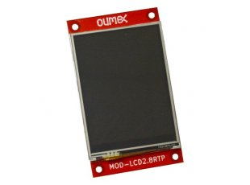
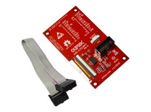

# MOD-LCD2.8RTP
TFT color LCD module with UEXT connector for ESP32-EVB

## Features

- 2.8" color TFT display
- 320*240 pixels
- LCD size: 69 x 50mm
- PCB size: 86 x 50mm
- Мount holes: 78 x 42 mm
- UEXT connector
- 10-pin ribbon cable with IDC connectors

## Datasheets

- [LCD](HARDWARE/DOCS/CXT280H02H34-200P50R.pdf)
- [ILI9341V](HARDWARE/DOCS/ILI9341V_v1.0.pdf)

## Board files

- [KiCad schematics](HARDWARE/SCHEMATICS)

## Support

- [Demo code](SOFTWARE)

## [Evaluation Board/Kit Important Notice](doc/web/evaluation-board-notice.md)
